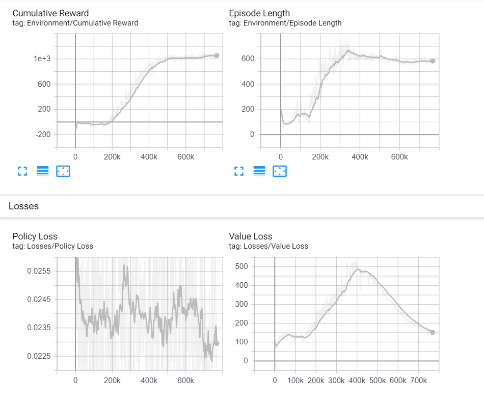

# Neural Rocket
This project is an experiment to see if a neural network can be taught to launch space rockets. For this purpose, I used [Unity](https://unity.com/) (for visualization) and [ML-Agents](https://github.com/Unity-Technologies/ml-agents) library (for neural network things). The main class where you can find the implementation of a rewards system can be found [here](https://github.com/Tearth/Neural-Rocket/blob/master/Neural%20Rocket/Assets/Scripts/Rocket/RocketAgent.cs).

The neural network used in this project contains 4 layers, described below.

#### Input layer
*every value is normalized to [-1..1] range*
 - **altitude** - from 0 to MaxOperationalAltitude
 - **target altitude** - from 0 to MaxOperationalAltitude
 - **x speed** - from -OrbitalSpeed * 2 to OrbitalSpeed * 2
 - **y speed** - from -OrbitalSpeed to OrbitalSpeed
 - **z rotation** - from -180 to 180 degrees
 - **angle of attack** - from -90 to 90 degrees
 - **z rotation speed** - from -PI/2 to PI/2

where default values are:
 - **MaxOperationalAltitude** = 20000 meters
 - **OrbitalSpeed** = 3000 m/s

#### First hidden layer
*32 neurons*

#### Second hidden layer
*32 neurons*

#### Output layer
*every value is normalized to [-1..1] range*
 - **gimbal** - from -MaxGimbal to MaxGimbal
 - **thrust** - from 0 to 100 percents

where default values are:
 - **MaxGimbal** = 15 degrees

## Development history
The first attempts to implement this problem were highly unsatisfactory - the neural network was unable to maintain constant course and the rocket was falling in the first seconds of flight.

Because it looked like the complexity of task was too high for the neural network, then I decided to simplify the problem by reducing available axes. Now rocket could move only in X and Y axis - this also applied to the rotation where only Z axis was available.

Now flight has started to look better, but it was still very bumpy, and what more important, rocked didn't gain horizontal speed which is necessary to fly into orbit. It was also frequent when a small change in the rewards system lead to strange results like this below (proudly called "rocket bunnies").

Refactoring of the rewards system, where the rocket began to be awarded for the last response (gimbal and thrust) rather than previous achievements made rocket finally learning proper flying. It was still quite bumpy, but its course was generally valid.

After a series of small adjustments and 100 learning sessions, the rocket started flying validly.

Typical learning session takes about 2, 3 hours and 600000 steps. After this point, the neural network doesn't improve its mean reward and episode length.

